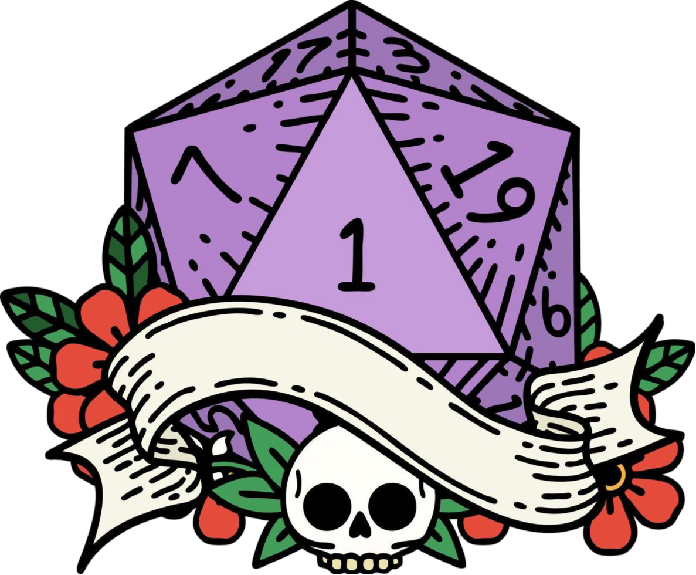

  
  <h1> Tavern of Disaster</h1>

 
  
  
  

   

  <h2> Project Description </h2>
  <p3>Tavern of Disaster is a project where I combine two of my favorites things: Programming and tabletop RPG. I started this project aiming a useful tool to use in my RPG sessions with my friends, and I still keep letting my imagination lead me to do the most creative and fun site I can!</p3>  
  <p3>In this project, I will exercise the knowledge of web development that I earned in college and online courses. I pretend to do the project alone with help of friends and generative AIs.</p3>

  

  <h2> Technologies Used </h2>

* [NodeJS](https://nodejs.org/pt)
* [PostgreSQL](https://www.postgresql.org/)
* [Prisma](https://www.prisma.io/)
* [React](https://react.dev/)
* [TypeScript](https://www.typescriptlang.org/)
* [NPM](https://www.npmjs.com/)
* Others: linux, vscode, webbrowser, wsl

 

  <h2> Deployiment </h2>

  [Tavern of Disaster](https://tavernofdisaster.bohr.io)

## Autor
[ Júnior Silva](https://github.com/jrchakalo)

 

  <h2> License </h2>
  <p3>Tavern of Disaster is MIT licensed.</p3>

The license can be found at [LICENSE.md](https://github.com/jrchakalo/Tavern-of-Disaster/blob/main/LICENSE)
