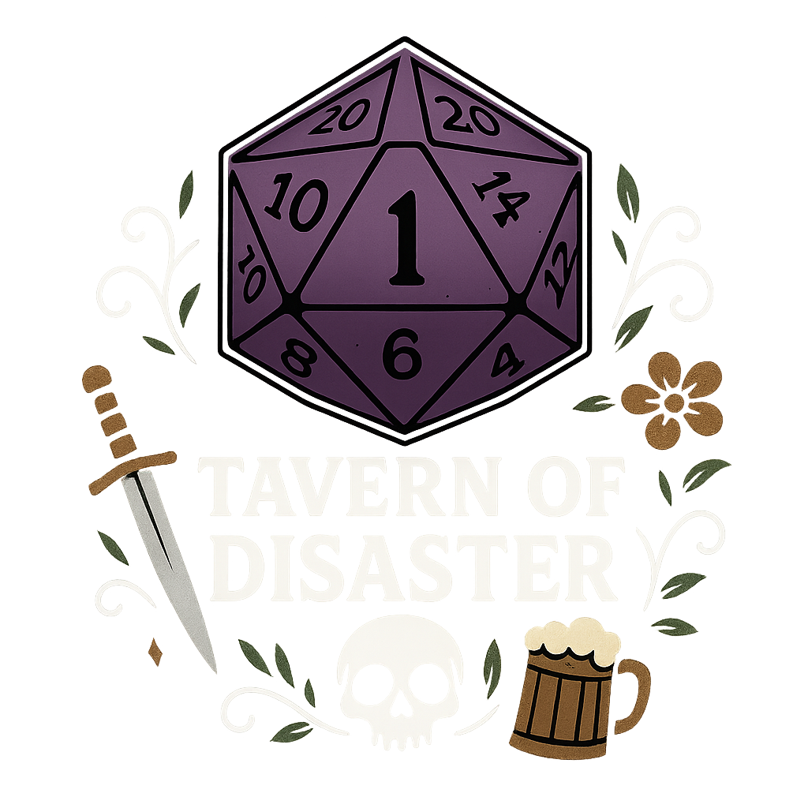

<div align="center">
  
</div>

<div align="center" style="display: inline_block"><br>
  
  
  
  <br/>
  <!-- Technology badges -->
  
  
  
  
  
</div><br><br><br>

## Project Description

Tavern of Disaster is a virtual tabletop where I mix two passions: web development and RPG. The goal is to build a lean, fast real‑time tool for my groups, iterating features as creativity (and playtest) demands.

Currently implemented core features:

* Real-time token placement & movement (Socket.IO)
* Multi-footprint tokens with footprint collision validation
* Measurement tools (ruler, cone, circle, square, line, beam) with optional persistence
* Auras linked to tokens (configurable radius/color)
* Initiative tracker with drag & reorder, active turn highlight and movement tracking
* Scene management (multiple battle maps / images per table)
* Per-scene grid scaling & dynamic meters-per-square broadcast by DM
* Ping system for players to draw quick attention
* Color selection & per-user measurement color persistence
* Session life cicle (Preparing → Live → Pause → Ended)
* Basic table CRUD and invite/join flow
* Responsive design

Roadmap ideas (not guaranteed / exploratory): 

* Upload of images, tokens and battlemaps
* Interactive dice and tests
* Character sheet
* Fog of war, area templates library
* Campaign notes
* Media layers
* Dark/light theme toggle
* Animation micro-interactions.

---

## Tech Stack

Backend:
* Node.js + Express
* TypeScript
* MongoDB + Mongoose (persistence for users, tables, scenes, tokens, initiative, auras, measurements)
* Socket.IO (real-time sync of tokens, initiative, measurements, pings)

Frontend:
* Vue 3 + Vite + TypeScript
* Pinia (state management)
* Socket.IO client
* Modern CSS design system (custom properties, utility classes)

Tooling & Misc:
* ESLint / TypeScript config
* npm scripts
* (Planned) Tests & CI pipeline

---

## Running Locally (dev)

Backend:
```bash
cd backend
npm install
npm run dev
```

Frontend (in a second terminal):
```bash
cd frontend
npm install
npm run dev
```

Default dev endpoints:
* Backend API / Socket: `http://localhost:3001`
* Frontend: `http://localhost:5173`

Environment variables: copy `.env.example` to `.env` in the project root and set values.
Frontend (optional) create `frontend/.env.local`:
```
VITE_API_URL=http://localhost:3001
VITE_SOCKET_URL=http://localhost:3001
```

---

## Deployment

Experimental deployment: [Tavern of Disaster]()

Production build (manual):
```bash
cd frontend && npm run build
```
Serve `frontend/dist` behind your preferred static host; ensure backend server URL is reachable and, if necessary, configure CORS & environment.

---

## Autor
[<br><sub>Júnior Silva</sub>](https://github.com/jrchakalo)

<br>

<div>
  <h2> License </h2>
  <p3>Tavern of Disaster is MIT licensed.</p3>
</div>

The license can be found at [LICENSE.md](https://github.com/jrchakalo/Tavern-of-Disaster/blob/main/LICENSE)
